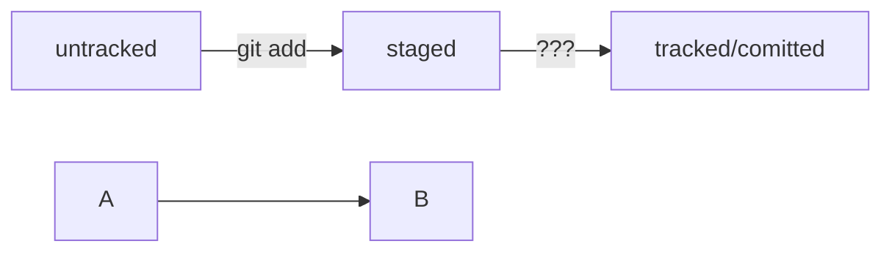

## Git theory

### Базовые консольные команды.

Home Directory или же домашняя директория - каталог с файлами пользователя
Имеет обозначение - **"~"**
Room Directory или же корневая директория - главная папка на диске (в большинстве случаев **"C:/"**)
Имеет обозначение - **"/"**

**"."** - означает текущую папку 

**cd** (change directory) - сметить директорию. 
Синтаксиз: 
```
cd dir_name
```
Возвращение к домашней директории - **cd ~**
Возвращение к корневой директории - **cd /**

Сделать шаг назад - **cd ..**

**pwd** (print working directory) - позволяет узнать где ты сейчас находишься;
Синтаксиз:
```
pwd
```
**ls** (list directory content) - показывает содержимое текущей директории
Cинтаксиз:
```
ls + ~/dir_name
```
**ls + ~/dir_name** - показывает содержимое каталога dir_name;

**ls** также как и cd работает с флагами (**"~"**, **"/"**, **"."**)

**ls -a** - флаг **"-a"** позволяет просмотреть скрытые директории

---

### Операции с папками и файлами. Создание. Команды touch и mkdir

**touch** или **touch + ~/file.txt** - создаёт файл в текущей директории или по пути, указанному через пробел
Пример:
```
touch text.txt
```

**mkdir** (make directory) или **mkdir ~/dir_name** - создаёт директорию в текущей директории или по пути, указанному через пробел
Пример:
```
mkdir first_project
```

**mkdir -p dir/inside_dir/dipper_inside_dir** - флаг **"-p"** позволяет создать сразу цепочку директорий (структуру директорий)
```
mkdir -p first_project/wwwroot/js
```

---

### Копирование и перемещение файла. Команды cp и mv

**cp (copy)** - копирование файла. 

Синтаксиз: 
```
cp file_name dir_name
```

Можно копировать сразу несколько файлов 
```
cp index.html script.js style.css wwwroot
```

**mv (move)** - Перемещение файла без копирования;

Синтаксиз аналогичен команде **cp**

---

### Чтение текста из файла. Команда cat

Предусматривает чтение как текстовых файлов, так и файлов с кодом, которые можно прочитать.

**cat (concatenate and print)**

Синтаксиз:
```
cat text.txt

```

---

### Удаление файлов и папок. Команды rm, rmdir, rm -r

**rm (remove)** - удаление файлов

Синтакиз:
```
rm file_name
```
**rmdir** - удаление директории

Синтакиз:
```
rmdir dir_name
```
При попытке удалить директорию с её содержимым командная строка выдаст ошибку. Для того чтобы это сделать надо воспользоваться флагом **-r**
```
rm -r dir_name
```

**-r** - (recursion) - рекурсивно. Тоесть данные будут удаляться рекурсивно

---

### Конфигурация Git .gitconfig 

Проверка версии git - **git version**

Работа с файлом настройки **.gitconfig**

Флаг **--global** - будет устанавливать глобальные настройик.

Для начала установим имя. Данное имя будет показывать кто сделал то или иное изменение

**git config --global user.name "arsen1us"**

И установим email:

**git config --global user.email email@gmail.com**

```
git config --global user.name "arsen1us" // имя пользователя

git config --global user.email email@gmail.com // его почта
```
Накстроки, которые мы сейчас внесли будут хранитсья в файле **.gitconfig**. Обратимся к нему:
```
cat ~/.gitconfig // или

git config --list
```

---

### Инициализация репозитория Git. Команда git init

Для инициализация репозитория перейдём в корневую папку проекта и введём команду:
```
git init
```
Если ошиблись в выборе папки то можно отменить инициализацию репозитория:
```
-rm -rf .git
```
Подготовка файлов в репозитории:
```
git add file_name
// или добавить всё 
git add --all
// добавить всю папку целиком
git add .
```
Отслеживание состояния:
```git status```
После введения данной команды вы увидете:

Зелёный текст - добавленные изменения;
Красные текст - ещё не добавленные изменения;

Создание commit:

**git commit -m** - флаг **"-m"** (message) означает сообщение (пояснение). Описывает какие изменения вы внесли.
```
git commit -m "Комментарий к commit"
```

Для того, чтобы увидеть список коммитов введите **git log**. После этого отобразиться список со всеми созданныим коммитама.
```
git log
```

---

### Удалённый репозиторий GitHub

Теперь всё готово для того, чтобы связать локульный репозиторий с удалёныым репозиторием на GitHub.

# H4 Шаги:
1. Перейдите на вкладку с вашими репозиториями;
2. Нажмите New;
3. Введите название репозитория (для удобства введите название вашего локального репозитория);
4. Перейдите в него и найдите там ссылку типа **"https://github.com/your_profile_name/rep_name"**;
5. Скопируйте эту ссылку;

6. Введите команду **git remote add origin "https://github.com/your_profile_name/rep_name"**

7. Проверить прошло ли всё успешно можно с помощью команды **git remote -v** (verhose)

8. Теперь можно отправить все наши изменения на удалённый репозиторий:

**git push origin main/master**

**main/master** - название ветки.
Пример:
```
git remote add origin "https://github.com/your_profile_name/rep_name"

git remote -v
origin  https://github.com/profile_name/repo_name (fetch)
origin  https://github.com/profile_name/repo_name (push)

git push origin main/master
Enumerating objects: 3, done.
Counting objects: 100% (3/3), done.
Writing objects: 100% (3/3), 237 bytes | 118.00 KiB/s, done.
Total 3 (delta 0), reused 0 (delta 0), pack-reused 0
To https://github.com/your_profile_name/rep_name
 * [new branch]      master -> master

```

---

Найстройте **SSH (Secure shell)**. Подробная инструкция [GitHub SSH](https://docs.github.com/en/authentication/connecting-to-github-with-ssh)

---

Xэш. Хэширование.

**Хэш** - представляет собой идентификатор коммита. К примеру, **2d28b1e048bf256f1127e3f3673fb3d4b5699b28**
Данную строку Git автоматически генерирует при каждом новом созданном коммите.
**Хэштрование** - способ преобразования данных/набора данных и получение его отпечатка. В нашем случае отпечатком выступает хэш код.

"Отпечаток" же хранит следующую информацию:
1. Когда был сделам коммит; 
2. Кем был сделан коммит (его имя и адрес);
3. Содержимое файлоа в рипозитории на момент коммита;
4. Ссылка на предыдущий коммит (родительский).

Всю эту информацию Git хэширует с помощью алгоритма SHA-1 (**S**ecure **H**ash **A**lgoritm 1) и получает для каждого коммита свой уникальный хэш.

Свойства хэширования:
1. Если хэш получить дважды для одного и того же набора данных, то результата будет гарантированно одинаковым.
2. Если хоть что-то в исходных данных поменять (хоть один символ), то хэш будет изменён;

Все хэши и их таблицу Git служебные файлы в папку .git.

Особое внимание уделите материалу о статусах и жизненном цикле файлов в Git. Схему изменения статусов можно описать словами. Например, modified+git add = staged.
 А можно усложнить задачу! Попробуйте использовать формат описания схем Mermaid. Принцип такой: вы описываете схему в специальном текстовом формате, а GitHub превращает описание в полноценную схему с блоками и стрелками.
Подсказка: как сделать mermaid-схему
Чтобы получить mermaid-схему в README.md, нужно добавить блок кода типа mermaid.
HEAD -- это голова.
Коммит -- это всему голова.
Статусы файлов:
<тут пустая строка!>

```mermaid
%% описание схемы
```
<и тут пустая строка!> 
Блоки кода в маркдауне начинаются и заканчиваются тремя символами ```. После первых трёх ``` можно указать, какой именно код будет внутри блока. Например: ```mermaid , ```bash, ```python, ```javascript и так далее. Если ничего не указать, GitHub будет считать весь код простым текстом.
💡 Перед блоком и после него нужны пустые строки, иначе GitHub может не понять, что это блок кода.
Два символа %% обозначают в mermaid строку-комментарий.
Чтобы сделать схему, нужно указать формат: graph LR. Graph — это простейший тип схем; для шпаргалки его будет достаточно.
Чтобы добавить элементы и связи (стрелки), используют строки вида A --> B. Такая строка создаст квадратные блоки А и B и соединит их стрелкой.

Дополнительно можно указывать текст на стрелке. Например, так: A -- "text" --> B.
Ниже вы найдёте заготовку для схемы статусов файлов.

Попробуйте описать схему самостоятельно и посмотреть, что получится!


